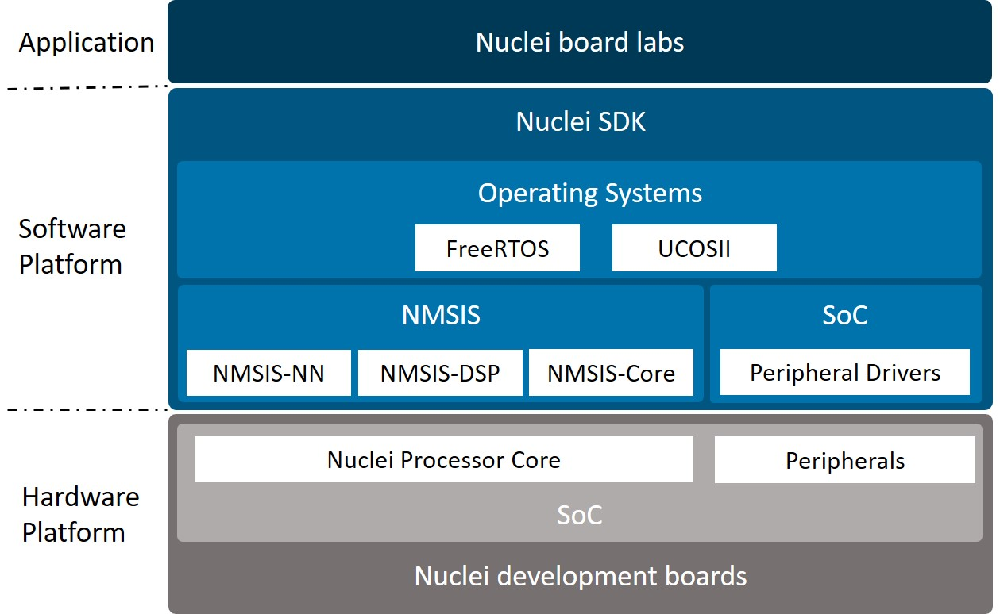

# Nuclei Board Labs

This is a handbook for Nuclei Board Labs which is a part of courses in Nuclei University Program.

This handbook describes how to develop with Nuclei Development Board through a step-by-step way,
it can be used as lab teaching metarials.

Anyone interested in Nuclei Processor Cores can also take this handbook as a quick start-up to develop with Nuclei Processor Cores in the field of embedded systems.

The hierarchy of Nuclei Board Labs are shown in the block diagram below.

The labs are developed based on the [Nuclei Software Development Kit (Nuclei SDK)](https://github.com/Nuclei-Software/nuclei-sdk) which is an open software platform to facilitate the software development of systems based on Nuclei Processor Cores.

In Nuclei SDK, the [Nuclei MCU Software Interface Standard (NMSIS)](https://github.com/Nuclei-Software/NMSIS) is a vendor-independent hardware abstraction layer for micro-controllers that are based on Nuclei Processor Cores.

For more details about this handbook, please click https://doc.nucleisys.com/nuclei_board_labs

## Board Labs Listing

> Generated by `python3 update.py` @ 2024-01-08 16:34:45

| Application | Board/SOC | Description |
| --- | --- | --- |
| [./cm32m433r-start/quickstart/running_led](./cm32m433r-start/quickstart/running_led) | cm32m433r-start | CM32M433R-START running_led lab |
| [./e203_hbirdv2/common/demo_iasm](./e203_hbirdv2/common/demo_iasm) | e203_hbirdv2 | Nuclei e203_hbirdv2 common demo_iasm lab |
| [./e203_hbirdv2/common/demo_nice](./e203_hbirdv2/common/demo_nice) | e203_hbirdv2 | Nuclei e203_hbirdv2 common demo_nice lab |
| [./e203_hbirdv2/common/gpio_toggle](./e203_hbirdv2/common/gpio_toggle) | e203_hbirdv2 | Nuclei e203_hbirdv2 common gpio_toggle lab |
| [./e203_hbirdv2/common/i2c_eeprom](./e203_hbirdv2/common/i2c_eeprom) | e203_hbirdv2 | Nuclei e203_hbirdv2 common i2c_eeprom lab |
| [./e203_hbirdv2/ddr200t/pwm_led](./e203_hbirdv2/ddr200t/pwm_led) | e203_hbirdv2 | Nuclei e203_hbirdv2 ddr200t pwm_led lab |
| [./e203_hbirdv2/ddr200t/spi_lcd](./e203_hbirdv2/ddr200t/spi_lcd) | e203_hbirdv2 | Nuclei e203_hbirdv2 ddr200t spi_lcd lab |
| [./e203_hbirdv2/mcu200t/pwm_led](./e203_hbirdv2/mcu200t/pwm_led) | e203_hbirdv2 | Nuclei e203_hbirdv2 mcu200t pwm_led lab |
| [./evalsoc/mmudemo](./evalsoc/mmudemo) | evalsoc | nuclei evalsoc mmu demo |
| [./evalsoc/rvv_examples](./evalsoc/rvv_examples) | evalsoc | RISC-V Vector Examples |
| [./evalsoc/zcmt_jumptable](./evalsoc/zcmt_jumptable) | evalsoc | Nuclei Zcmt Jump Table Demo |
| [./evalsoc/crypto_examples](./evalsoc/crypto_examples) | evalsoc | RISC-V Crypto(K extension) Examples |
| [./rvstar/adc/adc_regular_scan](./rvstar/adc/adc_regular_scan) | rvstar | Nuclei rvstar adc adc_regular_scan lab |
| [./rvstar/crc/crc_single_data](./rvstar/crc/crc_single_data) | rvstar | Nuclei rvstar crc crc_single_data lab |
| [./rvstar/dac/adc_dac_converter](./rvstar/dac/adc_dac_converter) | rvstar | Nuclei rvstar dac adc_dac_converter lab |
| [./rvstar/demo_iasm](./rvstar/demo_iasm) | rvstar | Nuclei rvstar demo_iasm lab |
| [./rvstar/dma/dma_ram_uart](./rvstar/dma/dma_ram_uart) | rvstar | Nuclei rvstar dma dma_ram_uart lab |
| [./rvstar/exti_key_interrupt](./rvstar/exti_key_interrupt) | rvstar | Nuclei rvstar exti_key_interrupt lab |
| [./rvstar/gpio/gpio_input_key](./rvstar/gpio/gpio_input_key) | rvstar | Nuclei rvstar gpio gpio_input_key lab |
| [./rvstar/gpio/gpio_output_led](./rvstar/gpio/gpio_output_led) | rvstar | Nuclei rvstar gpio gpio_output_led lab |
| [./rvstar/i2c/i2c_oled_screen](./rvstar/i2c/i2c_oled_screen) | rvstar | Nuclei rvstar i2c i2c_oled_screen lab |
| [./rvstar/nesting_of_interrupts](./rvstar/nesting_of_interrupts) | rvstar | Nuclei rvstar nesting_of_interrupts lab |
| [./rvstar/pmu/deepsleep_wakeup_exti](./rvstar/pmu/deepsleep_wakeup_exti) | rvstar | Nuclei rvstar pmu deepsleep_wakeup_exti lab |
| [./rvstar/rtc/rtc_display_time](./rvstar/rtc/rtc_display_time) | rvstar | Nuclei rvstar rtc rtc_display_time lab |
| [./rvstar/running_led](./rvstar/running_led) | rvstar | Nuclei rvstar running_led lab |
| [./rvstar/spi/spi_master_polling](./rvstar/spi/spi_master_polling) | rvstar | Nuclei rvstar spi spi_master_polling lab |
| [./rvstar/timer/timer_encoder_counter](./rvstar/timer/timer_encoder_counter) | rvstar | Nuclei rvstar timer timer_encoder_counter lab |
| [./rvstar/timer/timer_pwmout_buzzer](./rvstar/timer/timer_pwmout_buzzer) | rvstar | Nuclei rvstar timer timer_pwmout_buzzer lab |
| [./rvstar/timer/timer_pwmout_light](./rvstar/timer/timer_pwmout_light) | rvstar | Nuclei rvstar timer timer_pwmout_light lab |
| [./rvstar/uart/uart_control_led](./rvstar/uart/uart_control_led) | rvstar | Nuclei rvstar uart uart_control_led lab |
| [./rvstar/uart/uart_return_char](./rvstar/uart/uart_return_char) | rvstar | Nuclei rvstar uart uart_return_char lab |
| [./rvstar/uart/uart_return_string](./rvstar/uart/uart_return_string) | rvstar | Nuclei rvstar uart uart_return_string lab |
| [./rvstar/vectored_interrupt](./rvstar/vectored_interrupt) | rvstar | Nuclei rvstar vectored_interrupt lab |
| [./rvstar/wdgt/fwdgt_key_int](./rvstar/wdgt/fwdgt_key_int) | rvstar | Nuclei rvstar wdgt fwdgt_key_int lab |

## Use it in Nuclei Studio

> Nuclei Studio 2023.10 is required now.

> Some packages required may not yet updated to support 2023.10.

Open Nuclei Studio, and Open `RV-Tools` -> `Nuclei Package Management`, and download `sdk-nuclei_sdk`, `sdk-hbird_sdk` and `sdk-cm32m4xxr` see below.

And then you can download this repo as zip or directly download `bdp-nuclei_board_labs` package.

Then you can see extra board labs examples when you create New Nuclei RISC-V C/C++ Example.

## Use it in Nuclei SDK

Just download or clone the nuclei-board-labs repo to existing [nuclei sdk repo](https://github.com/Nuclei-Software/nuclei-sdk).

Make sure the source code structure as below.

~~~shell
<Nuclei SDK>:
  - Build
  - application
  - nuclei-board-labs # this repo
  - xxxxx
~~~

And then you can use it like other nuclei sdk applications.

## Add new board labs

If you are adding new board lab, you need to set `category: Board Labs` in `npk.yml`, so user can select board labs
via `category` in project example wizard.

You can refer to any example located in this folder.

