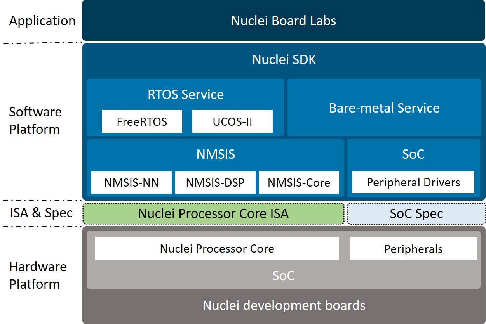
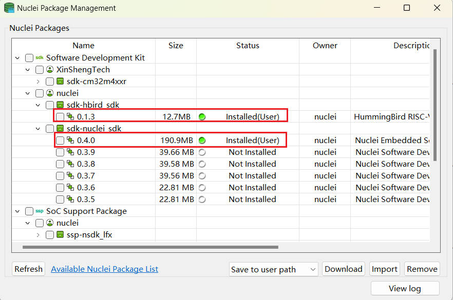

# Nuclei Board Labs

This is a handbook for Nuclei Board Labs which is a part of courses in Nuclei University Program.

This handbook describes how to develop with Nuclei Development Board through a step-by-step way,
it can be used as lab teaching metarials.

Anyone interested in Nuclei Processor Cores can also take this handbook as a quick start-up to develop with Nuclei Processor Cores in the field of embedded systems.

The hierarchy of Nuclei Board Labs are shown in the block diagram below.

The labs are developed based on the [Nuclei Software Development Kit (Nuclei SDK)](https://github.com/Nuclei-Software/nuclei-sdk) which is an open software platform to facilitate the software development of systems based on Nuclei Processor Cores.

In Nuclei SDK, the [Nuclei MCU Software Interface Standard (NMSIS)](https://github.com/Nuclei-Software/NMSIS) is a vendor-independent hardware abstraction layer for micro-controllers that are based on Nuclei Processor Cores.

For more details about this handbook, please click https://doc.nucleisys.com/nuclei_board_labs

## Use it in Nuclei Studio

Open Nuclei Studio, and Open `RV-Tools` -> `Nuclei Package Management`, and download `sdk-nuclei_sdk` and `sdk-hbird_sdk`, see below.

And then you can download this repo as zip or directly download `bdp-nuclei_board_labs` package.

Then you can see extra board labs examples when you create New Nuclei RISC-V C/C++ Example.

## Use it in Nuclei SDK

Just download or clone the nuclei-board-labs repo to existing [nuclei sdk repo](https://github.com/Nuclei-Software/nuclei-sdk).

Make sure the source code structure as below.

~~~shell
<Nuclei SDK>:
  - Build
  - application
  - nuclei-board-labs # this repo
  - xxxxx
~~~

And then you can use it like other nuclei sdk applications.
