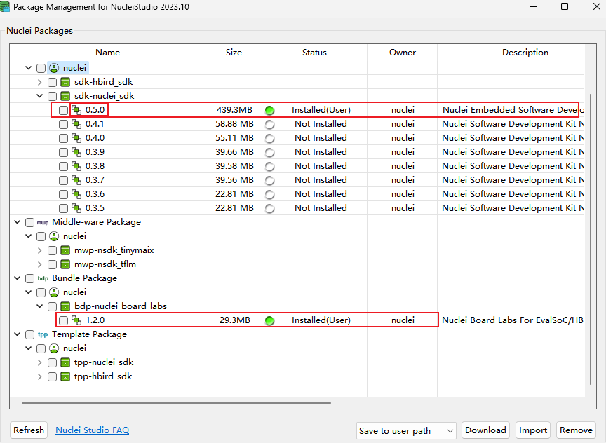
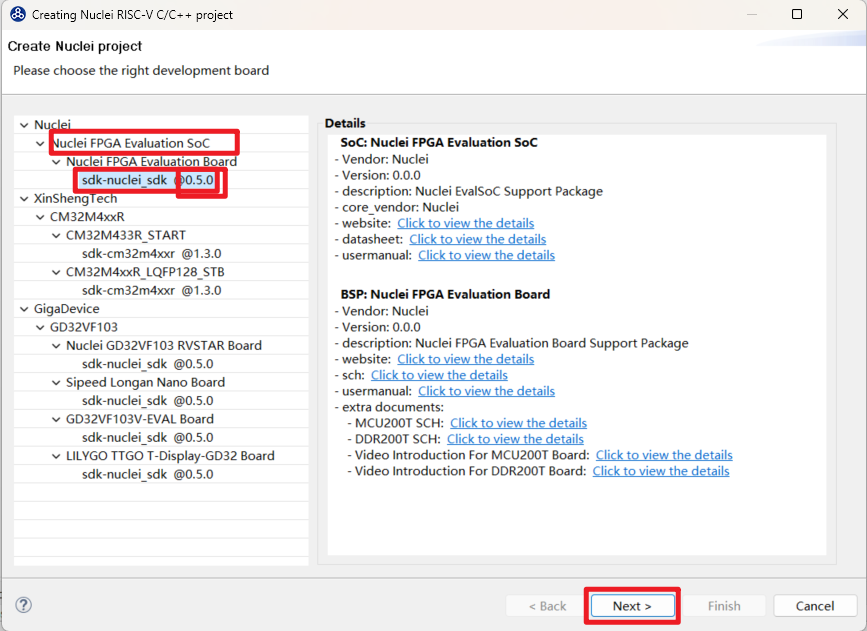
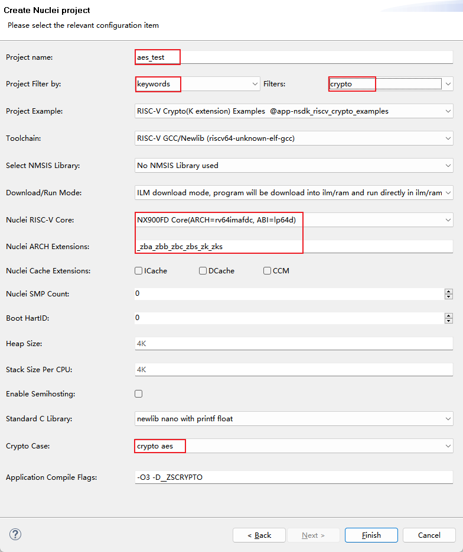
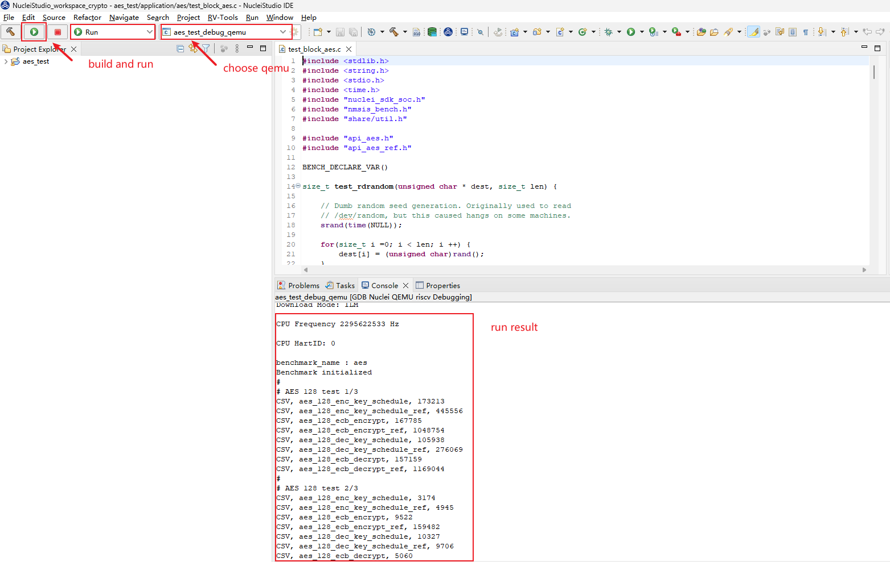

# RISC-V Crypto Examples For Nuclei SDK

These RISC-V Crypto Examples are modified based on https://github.com/riscv/riscv-crypto/blob/main/benchmarks/test/ to make it works for Nuclei SDK evalsoc.

That includes several cases are as follows:

* aes128/aes192/aes256
* sha3(only suport RV64)
* sha256
* sha512
* sm3
* sm4

## Run in command line

You need to download Nuclei SDK >= 0.5.0 version.

* **CASE**: default `aes`, which is used to specify which case you want to run.
* **CORE**: default `nx900fd` , nuclei support 300/600/900 series

~~~shell
cd /path/to/nuclei-sdk
cd nuclei-board-labs/evalsoc/crypto_examples
# build it
# Assume environment is already setup, see https://doc.nucleisys.com/nuclei_sdk/quickstart.html
# Require Nuclei Studio 2023.10
make CORE=nx900fd CASE=aes all
# run on qemu
make CORE=nx900fd CASE=aes run_qemu
# run on hw
# require NX900FD with k extension bitstream
make CORE=nx900fd CASE=aes upload
~~~

Here are logs of aes example:

~~~sh
nuclei-sdk/nuclei-board-labs/evalsoc/crypto_examples$ make CORE=nx900fd CASE=aes all run_qemu
make -C aes run_qemu
make[1]: ½øÈëĿ¼¡°nuclei-sdk/nuclei-board-labs/evalsoc/crypto_examples/aes¡±
Linking    :  aes.elf
   text    data     bss     dec     hex filename
  25360    2640    5000   33000    80e8 aes.elf
Run program aes.elf on qemu-system-riscv64
qemu-system-riscv64 -M nuclei_evalsoc,download=ilm -cpu nuclei-nx900fd,ext=_zba_zbb_zbc_zbs_zk_zks -smp 1 -icount shift=0 -nodefaults -nographic -serial stdio -kernel aes.elf
Nuclei SDK Build Time: Jan  8 2024, 14:23:45
Download Mode: ILM
CPU Frequency 999999078 Hz
CPU HartID: 0
benchmark_name : aes
Benchmark initialized
#
# AES 128 test 1/3
CSV, aes_128_enc_key_schedule, 60
CSV, aes_128_enc_key_schedule_ref, 473
CSV, aes_128_ecb_encrypt, 75
CSV, aes_128_ecb_encrypt_ref, 3000
CSV, aes_128_dec_key_schedule, 146
CSV, aes_128_dec_key_schedule_ref, 1041
CSV, aes_128_ecb_decrypt, 75
CSV, aes_128_ecb_decrypt_ref, 6342
#
# AES 128 test 2/3
CSV, aes_128_enc_key_schedule, 60
CSV, aes_128_enc_key_schedule_ref, 473
CSV, aes_128_ecb_encrypt, 75
CSV, aes_128_ecb_encrypt_ref, 2985
CSV, aes_128_dec_key_schedule, 146
CSV, aes_128_dec_key_schedule_ref, 1041
CSV, aes_128_ecb_decrypt, 75
CSV, aes_128_ecb_decrypt_ref, 6366
#
# AES 128 test 3/3
...
~~~

## Run in Nuclei Studio

> Nuclei Studio >= 2023.10 is required

You can download this NPK package from Nuclei Package Management or download this source code as zip, and import it.

During the `New Nuclei RISC-V C/C++ Project` project wizard, select `Nuclei FPGA Evaluation SoC`, and select `sdk-nuclei_sdk @0.5.0`

and then select `Crypto Examples` example, and choose one case in the choice `Crypto Case`, and then create an example.

Then you can build it and run it in IDE.

Here is aes example using IDE:

