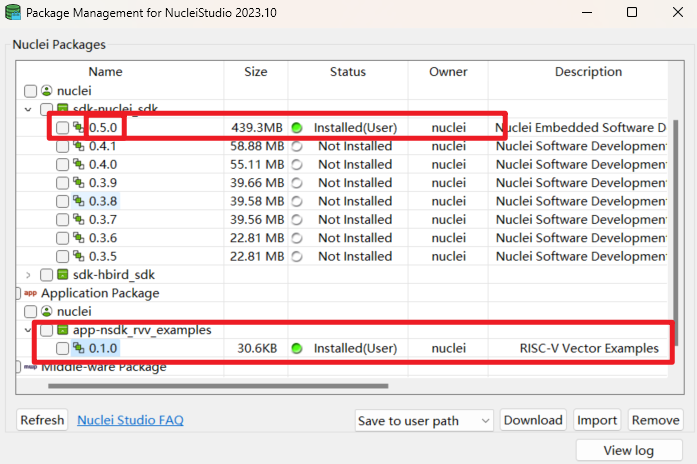
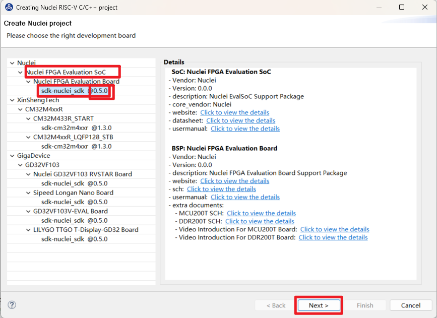
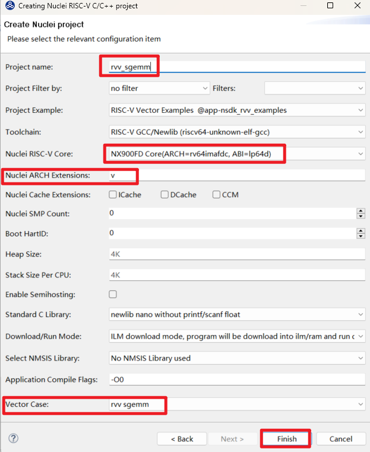

# RISC-V Vector Examples For Nuclei SDK

These RISC-V Vector Examples are modified based on https://github.com/riscv-non-isa/rvv-intrinsic-doc/tree/main/examples
to make it works for Nuclei SDK evalsoc.

## Run in command line

You need to download Nuclei SDK >= 0.5.0 version.

* **CASE**: default `branch`, which is used to specify which rvv_${CASE}.c you want to run, if set to `sgemm`, it means `rvv_sgemm.c` case.

~~~shell
cd /path/to/nuclei-sdk
cd nuclei-board-labs/evalsoc/rvv_examples
# clone this repo to this folder
# assume you have clone or download it to rvv_examples
cd rvv_examples
# build it
# Assume environment is already setup, see https://doc.nucleisys.com/nuclei_sdk/quickstart.html
# Require Nuclei Studio 2023.10
make all
# run on qemu
make run_qemu
# run on hw
# require NX900FD with vector enabled bitstream
make upload
~~~

## Run in Nuclei Studio

> Nuclei Studio >= 2023.10 is required

You can download this NPK package from Nuclei Package Management or download this source code as zip, and import it.

During the `New Nuclei RISC-V C/C++ Project` project wizard, select `Nuclei FPGA Evaluation SoC`, and select `sdk-nuclei_sdk @0.5.0`

and then select `RISC-V Vector Examples` example, and choose one case in the choice `Vector Case`, and then create an example.

Then you can build it and run it in IDE.

